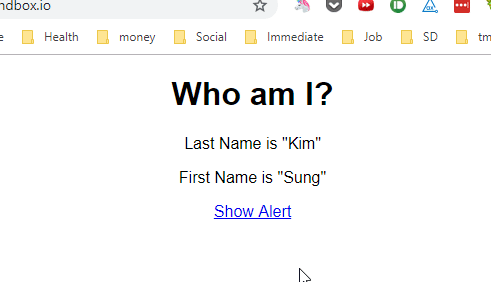

# dangerous


A utility function to create a dangerous/unsafe React component using tagged literal
templates.

The syntax is borrowed from [Styled Components](https://www.styled-components.com/).

`dangerous` returns a component, which uses
[dangerouslySetInnerHTML](https://reactjs.org/docs/dom-elements.html#dangerouslysetinnerhtml)
internally to convert your dangerous input to set literal to DOM's innerHTML
value.

# Requirement ⚠️

Minimum required version of React is v16.3.0 because  `dangerous` uses [React.forwardRef](https://reactjs.org/docs/react-api.html#reactforwardref), which was [introduced in v16.3.0](https://reactjs.org/blog/2018/03/29/react-v-16-3.html#forwardref-api).

## Installation

```sh
$ npm i dangerous
# or
$ yarn add dangerous
```

## Usage

### Basic Usage

You can pass raw HTML to `dangerous` using tagged template literal.

```js
const DangerousComponent = dangerous.div`Unsafe HTML`
// or
const DangerousComponent = dangerous('div')`Unsafe HTML`
```

You can Subtitute `div` with any valid [DOM elements](https://github.com/dance2die/dangerous/blob/master/src/domElements.ts) or a custom React component.  

```js
const DangerousComponent = dangerous.span`Unsafe HTML`
const DangerousComponent = dangerous.p`Unsafe HTML`
const DangerousComponent = dangerous.section`Unsafe HTML`
// and
const DangerousComponent = dangerous(CustomComponent)`Unsafe HTML`
```

### Advanced Usage

`dangerous` returns a React component, to which you can pass props, which you can access within tagged template literal.

```js
const DangerousComponent = dangerous.div`
  <h1>Who am I?</h1>
  <p>Last Name is "${props => props.lastName}"</p>
  <p>First Name is "${props => props.firstName}"</p>
  <a href="javascript:alert('${({ firstName, lastName }) =>
    `Hi ${firstName} ${lastName}`}');">Show Alert</a>`;

function App() {
  return <DangerousComponent firstName="Sung" lastName="Kim" />;
}
```

In the code above, `<DangerousComponent />` is passed following props in `App`.
1. `firstName="Sung"`
1. `lastName="Kim"`

You can access the props in the tagged literal using `${props => props.properyName}`.  
_This was taken directly from [Styled Component syntax](https://www.styled-components.com/docs/basics#passed-props)._

And you can destructure props and combine it to compose any string you want.

```js
const DangerousComponent = dangerous.div`
  //... omitted for brevity
  <a href="javascript:alert('${({ firstName, lastName }) => `Hi ${firstName} ${lastName}`}');">Show Alert</a>`;
```

### Return object

`dangerous` returns a React component and behaves like a HoC ([High-order Component](https://reactjs.org/docs/higher-order-components.html)).  


# 👨‍💻 Example

```javascript
const DangerousComponent = dangerous.div`
  <h1>Who am I?</h1>
  <p>Last Name is "${props => props.lastName}"</p>
  <p>First Name is "${props => props.firstName}"</p>
  <a href="javascript:alert('${({ firstName, lastName }) =>
    `Hi ${firstName} ${lastName}`}');">Show Alert</a>`;


function App() {
  return <Dangerous firstName="Sung" lastName="Kim" />;
}
```

[](https://codesandbox.io/s/x7ymrzw88q)

Code above will display the following and clicking on "Show Alert" link will show an alert.




# To Do
1. Create a GitHub project for version 1.
    1. Add TypeScript types
    1. Add TypeScript definition files to distribution
    1. Add tests
1. Update Logo to look as stylish as that of Styled Components's. 😄
