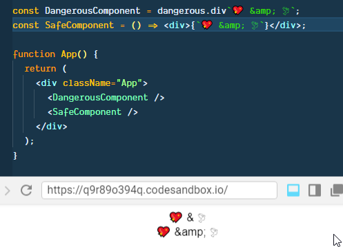

# ☢ dangerous


A utility function to create a dangerous/unsafe React component using tagged literal
templates.

The syntax is borrowed from [Styled Components](https://www.styled-components.com/).

`dangerous` returns a component, which uses
[dangerouslySetInnerHTML](https://reactjs.org/docs/dom-elements.html#dangerouslysetinnerhtml)
internally to convert your dangerous input to set literal to DOM's innerHTML
value.

# ⚠️ Requirement

Minimum required version of React is v16.3.0 because  `dangerous` uses [React.forwardRef](https://reactjs.org/docs/react-api.html#reactforwardref), which was [introduced in v16.3.0](https://reactjs.org/blog/2018/03/29/react-v-16-3.html#forwardref-api).

## Installation

```sh
$ npm i dangerous
# or
$ yarn add dangerous
```

## ✍ Usage

### 👶 Basic Usage

You can pass raw HTML to `dangerous` using tagged template literal.

```js
const DangerousComponent = dangerous.div`💖 &amp; 🕊`;
// or
const DangerousComponent = dangerous('div')`💖 &amp; 🕊`
```

You can Subtitute `div` with any valid [DOM elements](https://github.com/dance2die/dangerous/blob/master/src/domElements.ts) or a custom React component.  

```js
const DangerousComponent = dangerous.span`💖 &amp; 🕊`
const DangerousComponent = dangerous.p`💖 &amp; 🕊`
const DangerousComponent = dangerous.section`💖 &amp; 🕊`
// and
const DangerousComponent = dangerous(CustomComponent)`💖 &amp; 🕊`
```

#### Render Result

Dangerous component will set `&emp;` directly so the rendered result will show
```html
💖 & 🕊
```

while React will render it as
```html
💖 &amp; 🕊
```
as shown below.



### 🐱‍👤 Advanced Usage

`dangerous` returns a React component, to which you can pass props, which you can access within tagged template literal.

```js
const DangerousComponent = dangerous.div`
  <h1>Who am I?</h1>
  <p>Last Name is "${props => props.lastName}"</p>
  <p>First Name is "${props => props.firstName}"</p>
  <a href="javascript:alert('${({ firstName, lastName }) =>
    `Hi ${firstName} ${lastName}`}');">Show Alert</a>`;

function App() {
  return <DangerousComponent firstName="Sung" lastName="Kim" />;
}
```

In the code above, `<DangerousComponent />` is passed following props in `App`.
1. `firstName="Sung"`
1. `lastName="Kim"`

You can access the props in the tagged literal using `${props => props.properyName}`.  
_This was taken directly from [Styled Component syntax](https://www.styled-components.com/docs/basics#passed-props)._

And you can destructure props and combine it to compose any string you want.

```js
const DangerousComponent = dangerous.div`
  //... omitted for brevity
  <a href="javascript:alert('${({ firstName, lastName }) => `Hi ${firstName} ${lastName}`}');">Show Alert</a>`;
```

### ⤵ Return object

`dangerous` returns a React component and behaves like a HoC ([High-order Component](https://reactjs.org/docs/higher-order-components.html)).  

If a custom component is passed to `dangerous`, then all static properties will be hoisted down to the wrapped component.


# 👨‍💻 Example

The example below shows how to use `dangerous` with a custom `Block` components with static properties and Styled Components, `StyledDangerous` & `StyledBlock`.

It also demo's wrapping `StyledBlock` (a Styled Component component 😅) with `dangerous` as `DangerousStyled`.

[](https://codesandbox.io/s/q7vn2p20rq)

```jsx
import React from "react";
import ReactDOM from "react-dom";

import styled from "styled-components";
import dangerous from "dangerous";

import "./styles.css";

class Block extends React.Component {
  // To check if static fields are hoised correctly
  static count = 10;
  static increaseCount = () => console.log(++Block.count);
  static decreaseCount = () => console.log(--Block.count);

  render() {
    return <div {...this.props} />;
  }
}

const Dangerous = dangerous.div`
  <h1>Who am I?</h1>
  <p>Last Name is "${props => props.lastName}"</p>
  <p>First Name is "${props => props.firstName}"</p>
  <a href="javascript:alert('${({ firstName, lastName }) =>
    `Hi ${firstName} ${lastName}`}');">Show Alert</a>`;

const StyledDangerous = styled(Dangerous)`
  background-color: papayawhip;
  padding: 1.5em 0;
`;

const StyledBlock = styled(Block)`
  background-color: hotpink;
  padding: 1.5em 0;
`;

const DangerousStyled = dangerous(StyledBlock)`
  <h1>Alter Ego</h1>
  <p>Click link below to find out who my alter ego is</p>
  <a href="javascript:alert('${props => props.name}');">Show Aleter Ego Name</a>
`;

function App() {
  return (
    <div className="App">
      <section>
        <StyledDangerous firstName="Sung" lastName="Kim" />
        <DangerousStyled name="dance2die" />
      </section>
    </div>
  );
}

const rootElement = document.getElementById("root");
ReactDOM.render(<App />, rootElement);
```

### 🥊 Demo in action


# 💪 To Dos
1. Create a GitHub project for version 1.
    1. Add TypeScript types
    1. Add TypeScript definition files to distribution
    1. Add tests
1. Update Logo to look as stylish as that of Styled Components's. 😄
